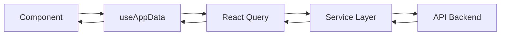
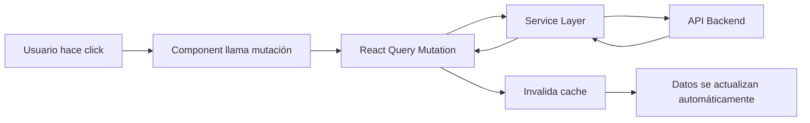

# 🎯 Guía Completa: Arquitectura de Peticiones Frontend

> **Objetivo**: Estructura moderna, escalable y fácil de mantener para todas las peticiones al backend

## 📖 Índice
1. [Conceptos Básicos](#conceptos-básicos)
2. [Flujo de Peticiones](#flujo-de-peticiones)
3. [Implementación Práctica](#implementación-práctica)
4. [Casos de Uso Reales](#casos-de-uso-reales)
5. [Próximos Pasos](#próximos-pasos)

---

## 🧠 Conceptos Básicos

### 🎭 **Separación de Responsabilidades**

```
📊 Server State (React Query)    📱 Client State (Pinia)
├── Datos del backend           ├── Estado de UI (diálogos)
├── Cache automático           ├── Formularios temporales
├── Loading states             ├── Navegación
└── Background refetch         └── Preferencias locales
```

### 🏗️ **Arquitectura de Capas**

```
🖥️  Component Layer              👁️  Lo que ves
    ↕️
🎯  Composable Layer (useAppData) 🧠  Lógica de datos
    ↕️
🛠️  Service Layer                ⚙️  Operaciones CRUD
    ↕️
🌐  API Layer                    📡  Comunicación HTTP
```

---

## 🚀 Flujo de Peticiones

### **1. Carga Inicial de Datos**



**En código:**

```typescript
// 🏠 En tu componente
const { players, matches, isLoading } = useAppData();

// 🎯 useAppData() internamente hace:
export function useAppData() {
  const { data: players } = useQuery({
    queryKey: ['players'],
    queryFn: () => playerService.getAll(), // 🛠️ Service layer
  });
  
  const { data: matches } = useQuery({
    queryKey: ['matches'],
    queryFn: () => matchService.getAll(), // 🛠️ Service layer
  });
  
  return { players, matches, isLoading: computed(() => ...) };
}
```

### **2. Operaciones CRUD (Mutaciones)**



**En código:**

```typescript
// 🏠 En tu componente
const { mutate: createPlayer } = useCreatePlayer();

const handleSubmit = () => {
  createPlayer(formData, {
    onSuccess: () => {
      // ✨ Los datos se actualizan automáticamente
      closeDialog();
    }
  });
};
```

### **3. Estados de Carga y Errores**

```typescript
const { players, isLoading, error } = useAppData();

// 🔄 Loading: mostrar skeleton
if (isLoading) return <Skeleton />;

// ❌ Error: mostrar mensaje
if (error) return <ErrorMessage error={error} />;

// ✅ Success: mostrar datos
return <PlayerList players={players} />;
```

---

## 🛠️ Implementación Práctica

### **Estructura de Archivos**

```
src/services/
├── 🎯 core/
│   └── useAppData.ts           # ⭐ PUNTO DE ENTRADA PRINCIPAL
├── 🏗️ base/
│   ├── apiClient.ts           # Configuración Axios
│   ├── BaseService.ts         # CRUD base reutilizable
│   └── queryKeys.ts           # Gestión de claves de cache
├── 👥 players/
│   ├── playerService.ts       # Lógica de negocio específica
│   ├── playerQueries.ts       # Consultas GET
│   ├── playerMutations.ts     # Operaciones POST/PUT/DELETE
│   └── index.ts               # Exportaciones
├── 🎾 matches/
│   ├── matchService.ts
│   ├── matchQueries.ts
│   ├── matchMutations.ts
│   └── index.ts
└── 📄 index.ts                 # Exportaciones centralizadas
```

### **Paso a Paso: Crear un Nuevo Servicio**

#### **1. Crear el Service (Lógica de Negocio)**

```typescript
// src/services/tournaments/tournamentService.ts
import { BaseService } from '@/services/base/BaseService';
import type { Tournament, TournamentSubmit } from '@/interfaces/TournamentInterfaces';

export class TournamentService extends BaseService<Tournament, TournamentSubmit> {
  constructor() {
    super('/tournaments');
  }

  // 🎯 Métodos específicos del dominio
  async getUpcoming(): Promise<Tournament[]> {
    const response = await this.apiClient.get(`${this.endpoint}/upcoming`);
    return response.data;
  }

  async addParticipant(tournamentId: number, playerId: number): Promise<void> {
    await this.apiClient.post(`${this.endpoint}/${tournamentId}/participants`, {
      playerId
    });
  }
}

export const tournamentService = new TournamentService();
```

#### **2. Crear las Queries (Consultas GET)**

```typescript
// src/services/tournaments/tournamentQueries.ts
import { useQuery } from '@tanstack/vue-query';
import { tournamentService } from './tournamentService';
import { queryKeys } from '@/services/base/queryKeys';

export function useTournaments() {
  return useQuery({
    queryKey: queryKeys.tournaments.all,
    queryFn: () => tournamentService.getAll(),
    staleTime: 5 * 60 * 1000, // 5 minutos
  });
}

export function useTournament(id: number) {
  return useQuery({
    queryKey: queryKeys.tournaments.detail(id),
    queryFn: () => tournamentService.getById(id),
    enabled: !!id,
  });
}

export function useUpcomingTournaments() {
  return useQuery({
    queryKey: queryKeys.tournaments.upcoming,
    queryFn: () => tournamentService.getUpcoming(),
  });
}
```

#### **3. Crear las Mutations (Operaciones CUD)**

```typescript
// src/services/tournaments/tournamentMutations.ts
import { useMutation, useQueryClient } from '@tanstack/vue-query';
import { tournamentService } from './tournamentService';
import { queryKeys } from '@/services/base/queryKeys';

export function useCreateTournament() {
  const queryClient = useQueryClient();
  
  return useMutation({
    mutationFn: tournamentService.create.bind(tournamentService),
    onSuccess: () => {
      // ✨ Invalida cache para que se actualicen los datos
      queryClient.invalidateQueries({ queryKey: queryKeys.tournaments.all });
    },
  });
}

export function useUpdateTournament() {
  const queryClient = useQueryClient();
  
  return useMutation({
    mutationFn: (data: { id: number; data: TournamentSubmit }) =>
      tournamentService.update(data.id, data.data),
    onSuccess: (_, variables) => {
      queryClient.invalidateQueries({ queryKey: queryKeys.tournaments.all });
      queryClient.invalidateQueries({ 
        queryKey: queryKeys.tournaments.detail(variables.id) 
      });
    },
  });
}

export function useAddTournamentParticipant() {
  const queryClient = useQueryClient();
  
  return useMutation({
    mutationFn: (data: { tournamentId: number; playerId: number }) =>
      tournamentService.addParticipant(data.tournamentId, data.playerId),
    onSuccess: (_, variables) => {
      queryClient.invalidateQueries({ 
        queryKey: queryKeys.tournaments.detail(variables.tournamentId) 
      });
    },
  });
}
```

#### **4. Exportar el Módulo**

```typescript
// src/services/tournaments/index.ts
export * from './tournamentService';
export * from './tournamentQueries';
export * from './tournamentMutations';
```

#### **5. Agregar al useAppData (si es necesario)**

```typescript
// src/services/core/useAppData.ts
import { useTournaments } from '@/services/tournaments';

export function useAppData() {
  // ... otras queries existentes
  
  const tournamentsQuery = useTournaments();
  
  return {
    // ... otros datos
    tournaments: computed(() => tournamentsQuery.data?.value || []),
    tournamentsQuery,
    isLoading: computed(() => 
      playersQuery.isLoading.value || 
      matchesQuery.isLoading.value ||
      tournamentsQuery.isLoading.value
    ),
  };
}
```

---

## 📝 Casos de Uso Reales

### **Caso 1: Lista Simple**

```vue
<!-- 📄 TournamentList.vue -->
<script setup lang="ts">
import { useAppData } from '@/services/core/useAppData';

const { tournaments, isLoading } = useAppData();
</script>

<template>
  <div>
    <div v-if="isLoading">Cargando torneos...</div>
    <div v-else>
      <div v-for="tournament in tournaments" :key="tournament.id">
        {{ tournament.name }}
      </div>
    </div>
  </div>
</template>
```

### **Caso 2: Formulario con Mutación**

```vue
<!-- 📄 CreateTournamentForm.vue -->
<script setup lang="ts">
import { ref } from 'vue';
import { useCreateTournament } from '@/services/tournaments';

const name = ref('');
const date = ref(new Date());

const { mutate: createTournament, isPending } = useCreateTournament();

const handleSubmit = () => {
  createTournament({
    name: name.value,
    date: date.value,
  }, {
    onSuccess: () => {
      // ✨ Los datos se actualizan automáticamente
      name.value = '';
      date.value = new Date();
      alert('Torneo creado exitosamente');
    },
    onError: (error) => {
      alert(`Error: ${error.message}`);
    }
  });
};
</script>

<template>
  <form @submit.prevent="handleSubmit">
    <input v-model="name" placeholder="Nombre del torneo" required />
    <input v-model="date" type="datetime-local" required />
    <button type="submit" :disabled="isPending">
      {{ isPending ? 'Creando...' : 'Crear Torneo' }}
    </button>
  </form>
</template>
```

### **Caso 3: Datos Relacionados**

```vue
<!-- 📄 TournamentDetail.vue -->
<script setup lang="ts">
import { computed } from 'vue';
import { useRoute } from 'vue-router';
import { useTournament, useAddTournamentParticipant } from '@/services/tournaments';
import { useAppData } from '@/services/core/useAppData';

const route = useRoute();
const tournamentId = computed(() => Number(route.params.id));

// 🎯 Datos específicos del torneo
const { data: tournament, isLoading } = useTournament(tournamentId.value);

// 🎯 Datos globales para seleccionar participantes
const { players } = useAppData();

// 🎯 Mutación para agregar participante
const { mutate: addParticipant } = useAddTournamentParticipant();

const handleAddParticipant = (playerId: number) => {
  addParticipant({
    tournamentId: tournamentId.value,
    playerId,
  });
};
</script>
```

---

## 🎯 Próximos Pasos

### **Servicios Recomendados para Implementar**

#### **1. 🏆 Tournament Service (Prioridad Alta)**
```typescript
// Funcionalidades necesarias:
- CRUD básico de torneos
- Gestión de participantes
- Gestión de fases/rondas
- Cálculo de rankings
```

#### **2. 📍 Places Service (Prioridad Media)**
```typescript
// Funcionalidades necesarias:
- CRUD de lugares
- Validación de disponibilidad
- Gestión de horarios
- Búsqueda por proximidad
```

#### **3. 🏅 Statistics Service (Prioridad Media)**
```typescript
// Funcionalidades necesarias:
- Estadísticas de jugadores
- Estadísticas de partidos
- Comparativas entre jugadores
- Históricos de rendimiento
```

#### **4. 📱 Notifications Service (Prioridad Baja)**
```typescript
// Funcionalidades necesarias:
- Sistema de notificaciones en tiempo real
- Notificaciones push
- Histórico de notificaciones
- Preferencias de usuario
```

#### **5. 👤 Users/Auth Service (Prioridad Baja)**
```typescript
// Funcionalidades necesarias:
- Autenticación y autorización
- Gestión de perfiles
- Roles y permisos
- Sesiones
```

### **Mejoras de Performance**

#### **1. Implementar Optimistic Updates**
```typescript
const { mutate: updateMatch } = useUpdateMatch({
  onMutate: async (newMatch) => {
    // 🚀 Actualizar UI inmediatamente
    await queryClient.cancelQueries({ queryKey: ['matches'] });
    const previousMatches = queryClient.getQueryData(['matches']);
    
    queryClient.setQueryData(['matches'], (old) => 
      old?.map(match => match.id === newMatch.id ? newMatch : match)
    );
    
    return { previousMatches };
  },
  onError: (err, newMatch, context) => {
    // 🔄 Revertir en caso de error
    queryClient.setQueryData(['matches'], context?.previousMatches);
  },
});
```

#### **2. Implementar Cache Selectivo**
```typescript
const { data: playerStats } = useQuery({
  queryKey: ['playerStats', playerId],
  queryFn: () => statisticsService.getPlayerStats(playerId),
  staleTime: 10 * 60 * 1000, // 10 minutos
  cacheTime: 30 * 60 * 1000, // 30 minutos
  select: (data) => ({
    // 🎯 Solo devolver datos necesarios
    winRate: data.matchesWon / data.matchesPlayed,
    recentMatches: data.matches.slice(0, 5),
  }),
});
```

#### **3. Implementar Background Sync**
```typescript
// 🔄 Auto-refetch cada 5 minutos cuando la ventana está activa
const { data: liveMatches } = useQuery({
  queryKey: ['liveMatches'],
  queryFn: () => matchService.getLiveMatches(),
  refetchInterval: 5 * 60 * 1000,
  refetchIntervalInBackground: false,
});
```

---

## ✅ Resumen para Estudiantes

### **🧠 Conceptos Clave**
1. **Separación de responsabilidades**: Server State vs Client State
2. **Cache inteligente**: React Query maneja automáticamente el cache
3. **Invalidación automática**: Los datos se actualizan solos tras mutaciones
4. **Loading states**: Estados de carga unificados
5. **Error handling**: Manejo consistente de errores

### **📋 Checklist de Implementación**
- [ ] ¿Tengo mi Service clase?
- [ ] ¿Tengo mis Queries para GET?
- [ ] ¿Tengo mis Mutations para CUD?
- [ ] ¿Exporté todo en index.ts?
- [ ] ¿Agregué al useAppData si es necesario?
- [ ] ¿Probé en un componente real?

### **🔧 Comandos Rápidos**
```bash
# Crear nuevo servicio
mkdir src/services/miServicio
touch src/services/miServicio/{index.ts,miServicioService.ts,miServicioQueries.ts,miServicioMutations.ts}

# Importar en componente
import { useMiServicio, useCreateMiServicio } from '@/services/miServicio';
```

---

**🎉 ¡Arquitectura moderna, escalable y fácil de mantener!**
